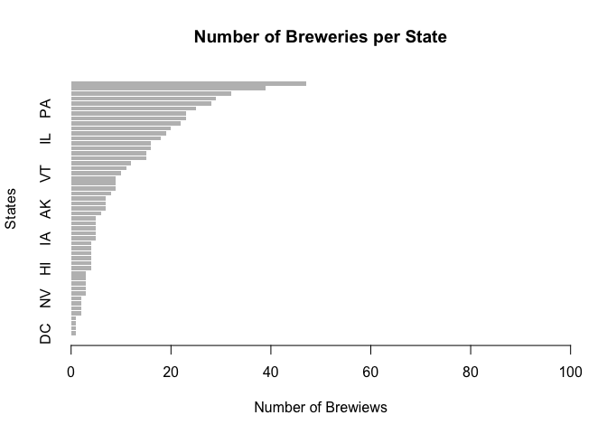

#
#<br>
#

#### Load the necessary library packages prior to loading the data. 
#### Packages used include : 
####   <em>  -tidyr
####   <em>  -dplyr
####   <em>  -plotly
####      -plotly
####      -forcats 


# <br>
##### 1. Read the beers data file Beers.csv and inspect the dataframe (head and tail).


```r
library(readr)
Beers <- read_csv("Beers.csv")
```

```
## Parsed with column specification:
## cols(
##   Name = col_character(),
##   Beer_ID = col_double(),
##   ABV = col_double(),
##   IBU = col_double(),
##   Brewery_id = col_double(),
##   Style = col_character(),
##   Ounces = col_double()
## )
```

```r
head(Beers)
```

```
## # A tibble: 6 x 7
##   Name           Beer_ID   ABV   IBU Brewery_id Style                Ounces
##   <chr>            <dbl> <dbl> <dbl>      <dbl> <chr>                 <dbl>
## 1 Pub Beer          1436 0.05     NA        409 American Pale Lager      12
## 2 Devil's Cup       2265 0.066    NA        178 American Pale Ale (…     12
## 3 Rise of the P…    2264 0.071    NA        178 American IPA             12
## 4 Sinister          2263 0.09     NA        178 American Double / I…     12
## 5 Sex and Candy     2262 0.075    NA        178 American IPA             12
## 6 Black Exodus      2261 0.077    NA        178 Oatmeal Stout            12
```


```r
tail(Beers)
```

```
## # A tibble: 6 x 7
##   Name               Beer_ID   ABV   IBU Brewery_id Style            Ounces
##   <chr>                <dbl> <dbl> <dbl>      <dbl> <chr>             <dbl>
## 1 Rocky Mountain Oy…    1035 0.075    NA        425 American Stout       12
## 2 Belgorado              928 0.067    45        425 Belgian IPA          12
## 3 Rail Yard Ale          807 0.052    NA        425 American Amber …     12
## 4 B3K Black Lager        620 0.055    NA        425 Schwarzbier          12
## 5 Silverback Pale A…     145 0.055    40        425 American Pale A…     12
## 6 Rail Yard Ale (20…      84 0.052    NA        425 American Amber …     12
```

##### 2. Read the breweries data file Breweries.csv and inspect the dataframe (head and tail).

```r
library(readr)
Breweries <- read_csv("Breweries.csv")
```

```
## Parsed with column specification:
## cols(
##   Brew_ID = col_double(),
##   Name = col_character(),
##   City = col_character(),
##   State = col_character()
## )
```

```r
head(Breweries)
```

```
## # A tibble: 6 x 4
##   Brew_ID Name                      City          State
##     <dbl> <chr>                     <chr>         <chr>
## 1       1 NorthGate Brewing         Minneapolis   MN   
## 2       2 Against the Grain Brewery Louisville    KY   
## 3       3 Jack's Abby Craft Lagers  Framingham    MA   
## 4       4 Mike Hess Brewing Company San Diego     CA   
## 5       5 Fort Point Beer Company   San Francisco CA   
## 6       6 COAST Brewing Company     Charleston    SC
```


```r
tail(Breweries)
```

```
## # A tibble: 6 x 4
##   Brew_ID Name                          City          State
##     <dbl> <chr>                         <chr>         <chr>
## 1     553 Mickey Finn's Brewery         Libertyville  IL   
## 2     554 Covington Brewhouse           Covington     LA   
## 3     555 Dave's Brewfarm               Wilson        WI   
## 4     556 Ukiah Brewing Company         Ukiah         CA   
## 5     557 Butternuts Beer and Ale       Garrattsville NY   
## 6     558 Sleeping Lady Brewing Company Anchorage     AK
```
##### 3. Inspect the data structures, rename columns that make sense and prepare to join the data sets. Joining could be accomplished with a left, right or full join. Full join is used in this case to preserve data from both tables.

```r
str(Breweries)
```

```
## Classes 'spec_tbl_df', 'tbl_df', 'tbl' and 'data.frame':	558 obs. of  4 variables:
##  $ Brew_ID: num  1 2 3 4 5 6 7 8 9 10 ...
##  $ Name   : chr  "NorthGate Brewing" "Against the Grain Brewery" "Jack's Abby Craft Lagers" "Mike Hess Brewing Company" ...
##  $ City   : chr  "Minneapolis" "Louisville" "Framingham" "San Diego" ...
##  $ State  : chr  "MN" "KY" "MA" "CA" ...
##  - attr(*, "spec")=
##   .. cols(
##   ..   Brew_ID = col_double(),
##   ..   Name = col_character(),
##   ..   City = col_character(),
##   ..   State = col_character()
##   .. )
```


```r
str(Beers)
```

```
## Classes 'spec_tbl_df', 'tbl_df', 'tbl' and 'data.frame':	2410 obs. of  7 variables:
##  $ Name      : chr  "Pub Beer" "Devil's Cup" "Rise of the Phoenix" "Sinister" ...
##  $ Beer_ID   : num  1436 2265 2264 2263 2262 ...
##  $ ABV       : num  0.05 0.066 0.071 0.09 0.075 0.077 0.045 0.065 0.055 0.086 ...
##  $ IBU       : num  NA NA NA NA NA NA NA NA NA NA ...
##  $ Brewery_id: num  409 178 178 178 178 178 178 178 178 178 ...
##  $ Style     : chr  "American Pale Lager" "American Pale Ale (APA)" "American IPA" "American Double / Imperial IPA" ...
##  $ Ounces    : num  12 12 12 12 12 12 12 12 12 12 ...
##  - attr(*, "spec")=
##   .. cols(
##   ..   Name = col_character(),
##   ..   Beer_ID = col_double(),
##   ..   ABV = col_double(),
##   ..   IBU = col_double(),
##   ..   Brewery_id = col_double(),
##   ..   Style = col_character(),
##   ..   Ounces = col_double()
##   .. )
```

```r
names(Breweries)
```

```
## [1] "Brew_ID" "Name"    "City"    "State"
```
##### Renamed Brewery_id to match the Brew_ID inthe Breweries dataset.

```r
names(Beers)
```

```
## [1] "Name"       "Beer_ID"    "ABV"        "IBU"        "Brewery_id"
## [6] "Style"      "Ounces"
```

```r
Beers <- rename(Beers, Brew_ID = Brewery_id)
names(Beers)
```

```
## [1] "Name"    "Beer_ID" "ABV"     "IBU"     "Brew_ID" "Style"   "Ounces"
```
##### Full join method.

```r
fullData <- full_join(Breweries, Beers, by = "Brew_ID")
```


```r
head(fullData)
```

```
## # A tibble: 6 x 10
##   Brew_ID Name.x   City   State Name.y  Beer_ID   ABV   IBU Style    Ounces
##     <dbl> <chr>    <chr>  <chr> <chr>     <dbl> <dbl> <dbl> <chr>     <dbl>
## 1       1 NorthGa… Minne… MN    Get To…    2692 0.045    50 America…     16
## 2       1 NorthGa… Minne… MN    Maggie…    2691 0.049    26 Milk / …     16
## 3       1 NorthGa… Minne… MN    Wall's…    2690 0.048    19 English…     16
## 4       1 NorthGa… Minne… MN    Pumpion    2689 0.06     38 Pumpkin…     16
## 5       1 NorthGa… Minne… MN    Strong…    2688 0.06     25 America…     16
## 6       1 NorthGa… Minne… MN    Parape…    2687 0.056    47 Extra S…     16
```
##### Another column renaming is needed to correct the data names after the join. 

```r
fullData <- rename(fullData, BreweryName = Name.x, BeerName = Name.y)
names(fullData)
```

```
##  [1] "Brew_ID"     "BreweryName" "City"        "State"       "BeerName"   
##  [6] "Beer_ID"     "ABV"         "IBU"         "Style"       "Ounces"
```

```r
fullData %>%
  group_by(State) %>%
  summarise(count = n())
```

```
## # A tibble: 51 x 2
##    State count
##    <chr> <int>
##  1 AK       25
##  2 AL       10
##  3 AR        5
##  4 AZ       47
##  5 CA      183
##  6 CO      265
##  7 CT       27
##  8 DC        8
##  9 DE        2
## 10 FL       58
## # … with 41 more rows
```
##### Exploring the number of breweries in each state, the Breweries.csv data is used. Grouped the Breweries data table by states.

```r
BrewStatesC <- Breweries%>%
  group_by(State)%>%
  summarise(count = n())
```


```r
head(BrewStatesC)
```

```
## # A tibble: 6 x 2
##   State count
##   <chr> <int>
## 1 AK        7
## 2 AL        3
## 3 AR        2
## 4 AZ       11
## 5 CA       39
## 6 CO       47
```

```r
state.freq <- table(Breweries$State)
barplot(state.freq[order(state.freq)], 
        horiz = T,
        border = NA,
        xlim = c(0, 100),
        main = "Number of Breweries per State",
        xlab = "Number of Brewiews",
        ylab = "States")
```

<!-- -->
#<br> 
# Counting the number of brewweries in each state:


```r
head(state.freq)
```

```
## 
## AK AL AR AZ CA CO 
##  7  3  2 11 39 47
```


```r
sDF<-data.frame(state.freq) 
sDF<- rename(sDF, State = Var1, Brew_Count=Freq)
```

#<br>

##### Plot the number of breweries in each state.


```r
p1 <- ggplot(Breweries, aes(x = fct_rev(fct_infreq(State)), fill = fct_infreq(State))) + geom_bar() + coord_flip() + theme(legend.position = "top")

ggplotly(p1)  
```

<!--html_preserve--><div id="htmlwidget-9c6a6ef9759f39bd55aa" style="width:672px;height:480px;" class="plotly html-widget"></div>
<script type="application/json" data-for="htmlwidget-9c6a6ef9759f39bd55aa">{"x":{"data":[{"orientation":"h","width":0.900000000000006,"base":0,"x":[47],"y":[51],"text":"count: 47<br />fct_rev(fct_infreq(State)): CO<br />fct_infreq(State): CO","type":"bar","marker":{"autocolorscale":false,"color":"rgba(248,118,109,1)","line":{"width":1.88976377952756,"color":"transparent"}},"name":"CO","legendgroup":"CO","showlegend":true,"xaxis":"x","yaxis":"y","hoverinfo":"text","frame":null},{"orientation":"h","width":0.900000000000006,"base":0,"x":[39],"y":[50],"text":"count: 39<br />fct_rev(fct_infreq(State)): CA<br />fct_infreq(State): CA","type":"bar","marker":{"autocolorscale":false,"color":"rgba(243,123,89,1)","line":{"width":1.88976377952756,"color":"transparent"}},"name":"CA","legendgroup":"CA","showlegend":true,"xaxis":"x","yaxis":"y","hoverinfo":"text","frame":null},{"orientation":"h","width":0.900000000000006,"base":0,"x":[32],"y":[49],"text":"count: 32<br />fct_rev(fct_infreq(State)): MI<br />fct_infreq(State): MI","type":"bar","marker":{"autocolorscale":false,"color":"rgba(238,128,66,1)","line":{"width":1.88976377952756,"color":"transparent"}},"name":"MI","legendgroup":"MI","showlegend":true,"xaxis":"x","yaxis":"y","hoverinfo":"text","frame":null},{"orientation":"h","width":0.900000000000006,"base":0,"x":[29],"y":[48],"text":"count: 29<br />fct_rev(fct_infreq(State)): OR<br />fct_infreq(State): OR","type":"bar","marker":{"autocolorscale":false,"color":"rgba(231,133,30,1)","line":{"width":1.88976377952756,"color":"transparent"}},"name":"OR","legendgroup":"OR","showlegend":true,"xaxis":"x","yaxis":"y","hoverinfo":"text","frame":null},{"orientation":"h","width":0.900000000000006,"base":0,"x":[28],"y":[47],"text":"count: 28<br />fct_rev(fct_infreq(State)): TX<br />fct_infreq(State): TX","type":"bar","marker":{"autocolorscale":false,"color":"rgba(224,138,0,1)","line":{"width":1.88976377952756,"color":"transparent"}},"name":"TX","legendgroup":"TX","showlegend":true,"xaxis":"x","yaxis":"y","hoverinfo":"text","frame":null},{"orientation":"h","width":0.900000000000006,"base":0,"x":[25],"y":[46],"text":"count: 25<br />fct_rev(fct_infreq(State)): PA<br />fct_infreq(State): PA","type":"bar","marker":{"autocolorscale":false,"color":"rgba(217,143,0,1)","line":{"width":1.88976377952756,"color":"transparent"}},"name":"PA","legendgroup":"PA","showlegend":true,"xaxis":"x","yaxis":"y","hoverinfo":"text","frame":null},{"orientation":"h","width":0.900000000000006,"base":0,"x":[23],"y":[45],"text":"count: 23<br />fct_rev(fct_infreq(State)): MA<br />fct_infreq(State): MA","type":"bar","marker":{"autocolorscale":false,"color":"rgba(208,148,0,1)","line":{"width":1.88976377952756,"color":"transparent"}},"name":"MA","legendgroup":"MA","showlegend":true,"xaxis":"x","yaxis":"y","hoverinfo":"text","frame":null},{"orientation":"h","width":0.900000000000006,"base":0,"x":[23],"y":[44],"text":"count: 23<br />fct_rev(fct_infreq(State)): WA<br />fct_infreq(State): WA","type":"bar","marker":{"autocolorscale":false,"color":"rgba(199,152,0,1)","line":{"width":1.88976377952756,"color":"transparent"}},"name":"WA","legendgroup":"WA","showlegend":true,"xaxis":"x","yaxis":"y","hoverinfo":"text","frame":null},{"orientation":"h","width":0.900000000000006,"base":0,"x":[22],"y":[43],"text":"count: 22<br />fct_rev(fct_infreq(State)): IN<br />fct_infreq(State): IN","type":"bar","marker":{"autocolorscale":false,"color":"rgba(189,157,0,1)","line":{"width":1.88976377952756,"color":"transparent"}},"name":"IN","legendgroup":"IN","showlegend":true,"xaxis":"x","yaxis":"y","hoverinfo":"text","frame":null},{"orientation":"h","width":0.900000000000006,"base":0,"x":[20],"y":[42],"text":"count: 20<br />fct_rev(fct_infreq(State)): WI<br />fct_infreq(State): WI","type":"bar","marker":{"autocolorscale":false,"color":"rgba(178,161,0,1)","line":{"width":1.88976377952756,"color":"transparent"}},"name":"WI","legendgroup":"WI","showlegend":true,"xaxis":"x","yaxis":"y","hoverinfo":"text","frame":null},{"orientation":"h","width":0.900000000000006,"base":0,"x":[19],"y":[41],"text":"count: 19<br />fct_rev(fct_infreq(State)): NC<br />fct_infreq(State): NC","type":"bar","marker":{"autocolorscale":false,"color":"rgba(165,165,0,1)","line":{"width":1.88976377952756,"color":"transparent"}},"name":"NC","legendgroup":"NC","showlegend":true,"xaxis":"x","yaxis":"y","hoverinfo":"text","frame":null},{"orientation":"h","width":0.900000000000006,"base":0,"x":[18],"y":[40],"text":"count: 18<br />fct_rev(fct_infreq(State)): IL<br />fct_infreq(State): IL","type":"bar","marker":{"autocolorscale":false,"color":"rgba(152,168,0,1)","line":{"width":1.88976377952756,"color":"transparent"}},"name":"IL","legendgroup":"IL","showlegend":true,"xaxis":"x","yaxis":"y","hoverinfo":"text","frame":null},{"orientation":"h","width":0.900000000000006,"base":0,"x":[16],"y":[39],"text":"count: 16<br />fct_rev(fct_infreq(State)): NY<br />fct_infreq(State): NY","type":"bar","marker":{"autocolorscale":false,"color":"rgba(137,172,0,1)","line":{"width":1.88976377952756,"color":"transparent"}},"name":"NY","legendgroup":"NY","showlegend":true,"xaxis":"x","yaxis":"y","hoverinfo":"text","frame":null},{"orientation":"h","width":0.900000000000006,"base":0,"x":[16],"y":[38],"text":"count: 16<br />fct_rev(fct_infreq(State)): VA<br />fct_infreq(State): VA","type":"bar","marker":{"autocolorscale":false,"color":"rgba(119,175,0,1)","line":{"width":1.88976377952756,"color":"transparent"}},"name":"VA","legendgroup":"VA","showlegend":true,"xaxis":"x","yaxis":"y","hoverinfo":"text","frame":null},{"orientation":"h","width":0.900000000000006,"base":0,"x":[15],"y":[37],"text":"count: 15<br />fct_rev(fct_infreq(State)): FL<br />fct_infreq(State): FL","type":"bar","marker":{"autocolorscale":false,"color":"rgba(98,178,0,1)","line":{"width":1.88976377952756,"color":"transparent"}},"name":"FL","legendgroup":"FL","showlegend":true,"xaxis":"x","yaxis":"y","hoverinfo":"text","frame":null},{"orientation":"h","width":0.900000000000006,"base":0,"x":[15],"y":[36],"text":"count: 15<br />fct_rev(fct_infreq(State)): OH<br />fct_infreq(State): OH","type":"bar","marker":{"autocolorscale":false,"color":"rgba(69,181,0,1)","line":{"width":1.88976377952756,"color":"transparent"}},"name":"OH","legendgroup":"OH","showlegend":true,"xaxis":"x","yaxis":"y","hoverinfo":"text","frame":null},{"orientation":"h","width":0.900000000000006,"base":0,"x":[12],"y":[35],"text":"count: 12<br />fct_rev(fct_infreq(State)): MN<br />fct_infreq(State): MN","type":"bar","marker":{"autocolorscale":false,"color":"rgba(0,183,9,1)","line":{"width":1.88976377952756,"color":"transparent"}},"name":"MN","legendgroup":"MN","showlegend":true,"xaxis":"x","yaxis":"y","hoverinfo":"text","frame":null},{"orientation":"h","width":0.900000000000006,"base":0,"x":[11],"y":[34],"text":"count: 11<br />fct_rev(fct_infreq(State)): AZ<br />fct_infreq(State): AZ","type":"bar","marker":{"autocolorscale":false,"color":"rgba(0,186,56,1)","line":{"width":1.88976377952756,"color":"transparent"}},"name":"AZ","legendgroup":"AZ","showlegend":true,"xaxis":"x","yaxis":"y","hoverinfo":"text","frame":null},{"orientation":"h","width":0.900000000000006,"base":0,"x":[10],"y":[33],"text":"count: 10<br />fct_rev(fct_infreq(State)): VT<br />fct_infreq(State): VT","type":"bar","marker":{"autocolorscale":false,"color":"rgba(0,188,81,1)","line":{"width":1.88976377952756,"color":"transparent"}},"name":"VT","legendgroup":"VT","showlegend":true,"xaxis":"x","yaxis":"y","hoverinfo":"text","frame":null},{"orientation":"h","width":0.900000000000002,"base":0,"x":[9],"y":[32],"text":"count:  9<br />fct_rev(fct_infreq(State)): ME<br />fct_infreq(State): ME","type":"bar","marker":{"autocolorscale":false,"color":"rgba(0,189,101,1)","line":{"width":1.88976377952756,"color":"transparent"}},"name":"ME","legendgroup":"ME","showlegend":true,"xaxis":"x","yaxis":"y","hoverinfo":"text","frame":null},{"orientation":"h","width":0.899999999999999,"base":0,"x":[9],"y":[31],"text":"count:  9<br />fct_rev(fct_infreq(State)): MO<br />fct_infreq(State): MO","type":"bar","marker":{"autocolorscale":false,"color":"rgba(0,191,119,1)","line":{"width":1.88976377952756,"color":"transparent"}},"name":"MO","legendgroup":"MO","showlegend":true,"xaxis":"x","yaxis":"y","hoverinfo":"text","frame":null},{"orientation":"h","width":0.899999999999999,"base":0,"x":[9],"y":[30],"text":"count:  9<br />fct_rev(fct_infreq(State)): MT<br />fct_infreq(State): MT","type":"bar","marker":{"autocolorscale":false,"color":"rgba(0,192,135,1)","line":{"width":1.88976377952756,"color":"transparent"}},"name":"MT","legendgroup":"MT","showlegend":true,"xaxis":"x","yaxis":"y","hoverinfo":"text","frame":null},{"orientation":"h","width":0.899999999999999,"base":0,"x":[8],"y":[29],"text":"count:  8<br />fct_rev(fct_infreq(State)): CT<br />fct_infreq(State): CT","type":"bar","marker":{"autocolorscale":false,"color":"rgba(0,192,150,1)","line":{"width":1.88976377952756,"color":"transparent"}},"name":"CT","legendgroup":"CT","showlegend":true,"xaxis":"x","yaxis":"y","hoverinfo":"text","frame":null},{"orientation":"h","width":0.899999999999999,"base":0,"x":[7],"y":[28],"text":"count:  7<br />fct_rev(fct_infreq(State)): AK<br />fct_infreq(State): AK","type":"bar","marker":{"autocolorscale":false,"color":"rgba(0,193,164,1)","line":{"width":1.88976377952756,"color":"transparent"}},"name":"AK","legendgroup":"AK","showlegend":true,"xaxis":"x","yaxis":"y","hoverinfo":"text","frame":null},{"orientation":"h","width":0.899999999999999,"base":0,"x":[7],"y":[27],"text":"count:  7<br />fct_rev(fct_infreq(State)): GA<br />fct_infreq(State): GA","type":"bar","marker":{"autocolorscale":false,"color":"rgba(0,192,178,1)","line":{"width":1.88976377952756,"color":"transparent"}},"name":"GA","legendgroup":"GA","showlegend":true,"xaxis":"x","yaxis":"y","hoverinfo":"text","frame":null},{"orientation":"h","width":0.899999999999999,"base":0,"x":[7],"y":[26],"text":"count:  7<br />fct_rev(fct_infreq(State)): MD<br />fct_infreq(State): MD","type":"bar","marker":{"autocolorscale":false,"color":"rgba(0,192,190,1)","line":{"width":1.88976377952756,"color":"transparent"}},"name":"MD","legendgroup":"MD","showlegend":true,"xaxis":"x","yaxis":"y","hoverinfo":"text","frame":null},{"orientation":"h","width":0.899999999999999,"base":0,"x":[6],"y":[25],"text":"count:  6<br />fct_rev(fct_infreq(State)): OK<br />fct_infreq(State): OK","type":"bar","marker":{"autocolorscale":false,"color":"rgba(0,190,202,1)","line":{"width":1.88976377952756,"color":"transparent"}},"name":"OK","legendgroup":"OK","showlegend":true,"xaxis":"x","yaxis":"y","hoverinfo":"text","frame":null},{"orientation":"h","width":0.899999999999999,"base":0,"x":[5],"y":[24],"text":"count:  5<br />fct_rev(fct_infreq(State)): IA<br />fct_infreq(State): IA","type":"bar","marker":{"autocolorscale":false,"color":"rgba(0,188,214,1)","line":{"width":1.88976377952756,"color":"transparent"}},"name":"IA","legendgroup":"IA","showlegend":true,"xaxis":"x","yaxis":"y","hoverinfo":"text","frame":null},{"orientation":"h","width":0.899999999999999,"base":0,"x":[5],"y":[23],"text":"count:  5<br />fct_rev(fct_infreq(State)): ID<br />fct_infreq(State): ID","type":"bar","marker":{"autocolorscale":false,"color":"rgba(0,186,224,1)","line":{"width":1.88976377952756,"color":"transparent"}},"name":"ID","legendgroup":"ID","showlegend":true,"xaxis":"x","yaxis":"y","hoverinfo":"text","frame":null},{"orientation":"h","width":0.899999999999999,"base":0,"x":[5],"y":[22],"text":"count:  5<br />fct_rev(fct_infreq(State)): LA<br />fct_infreq(State): LA","type":"bar","marker":{"autocolorscale":false,"color":"rgba(0,183,233,1)","line":{"width":1.88976377952756,"color":"transparent"}},"name":"LA","legendgroup":"LA","showlegend":true,"xaxis":"x","yaxis":"y","hoverinfo":"text","frame":null},{"orientation":"h","width":0.899999999999999,"base":0,"x":[5],"y":[21],"text":"count:  5<br />fct_rev(fct_infreq(State)): NE<br />fct_infreq(State): NE","type":"bar","marker":{"autocolorscale":false,"color":"rgba(0,179,242,1)","line":{"width":1.88976377952756,"color":"transparent"}},"name":"NE","legendgroup":"NE","showlegend":true,"xaxis":"x","yaxis":"y","hoverinfo":"text","frame":null},{"orientation":"h","width":0.899999999999999,"base":0,"x":[5],"y":[20],"text":"count:  5<br />fct_rev(fct_infreq(State)): RI<br />fct_infreq(State): RI","type":"bar","marker":{"autocolorscale":false,"color":"rgba(0,174,249,1)","line":{"width":1.88976377952756,"color":"transparent"}},"name":"RI","legendgroup":"RI","showlegend":true,"xaxis":"x","yaxis":"y","hoverinfo":"text","frame":null},{"orientation":"h","width":0.899999999999999,"base":0,"x":[4],"y":[19],"text":"count:  4<br />fct_rev(fct_infreq(State)): HI<br />fct_infreq(State): HI","type":"bar","marker":{"autocolorscale":false,"color":"rgba(0,169,255,1)","line":{"width":1.88976377952756,"color":"transparent"}},"name":"HI","legendgroup":"HI","showlegend":true,"xaxis":"x","yaxis":"y","hoverinfo":"text","frame":null},{"orientation":"h","width":0.899999999999999,"base":0,"x":[4],"y":[18],"text":"count:  4<br />fct_rev(fct_infreq(State)): KY<br />fct_infreq(State): KY","type":"bar","marker":{"autocolorscale":false,"color":"rgba(41,163,255,1)","line":{"width":1.88976377952756,"color":"transparent"}},"name":"KY","legendgroup":"KY","showlegend":true,"xaxis":"x","yaxis":"y","hoverinfo":"text","frame":null},{"orientation":"h","width":0.899999999999999,"base":0,"x":[4],"y":[17],"text":"count:  4<br />fct_rev(fct_infreq(State)): NM<br />fct_infreq(State): NM","type":"bar","marker":{"autocolorscale":false,"color":"rgba(97,156,255,1)","line":{"width":1.88976377952756,"color":"transparent"}},"name":"NM","legendgroup":"NM","showlegend":true,"xaxis":"x","yaxis":"y","hoverinfo":"text","frame":null},{"orientation":"h","width":0.899999999999999,"base":0,"x":[4],"y":[16],"text":"count:  4<br />fct_rev(fct_infreq(State)): SC<br />fct_infreq(State): SC","type":"bar","marker":{"autocolorscale":false,"color":"rgba(130,149,255,1)","line":{"width":1.88976377952756,"color":"transparent"}},"name":"SC","legendgroup":"SC","showlegend":true,"xaxis":"x","yaxis":"y","hoverinfo":"text","frame":null},{"orientation":"h","width":0.899999999999999,"base":0,"x":[4],"y":[15],"text":"count:  4<br />fct_rev(fct_infreq(State)): UT<br />fct_infreq(State): UT","type":"bar","marker":{"autocolorscale":false,"color":"rgba(156,141,255,1)","line":{"width":1.88976377952756,"color":"transparent"}},"name":"UT","legendgroup":"UT","showlegend":true,"xaxis":"x","yaxis":"y","hoverinfo":"text","frame":null},{"orientation":"h","width":0.899999999999999,"base":0,"x":[4],"y":[14],"text":"count:  4<br />fct_rev(fct_infreq(State)): WY<br />fct_infreq(State): WY","type":"bar","marker":{"autocolorscale":false,"color":"rgba(177,134,255,1)","line":{"width":1.88976377952756,"color":"transparent"}},"name":"WY","legendgroup":"WY","showlegend":true,"xaxis":"x","yaxis":"y","hoverinfo":"text","frame":null},{"orientation":"h","width":0.899999999999999,"base":0,"x":[3],"y":[13],"text":"count:  3<br />fct_rev(fct_infreq(State)): AL<br />fct_infreq(State): AL","type":"bar","marker":{"autocolorscale":false,"color":"rgba(195,126,255,1)","line":{"width":1.88976377952756,"color":"transparent"}},"name":"AL","legendgroup":"AL","showlegend":true,"xaxis":"x","yaxis":"y","hoverinfo":"text","frame":null},{"orientation":"h","width":0.899999999999999,"base":0,"x":[3],"y":[12],"text":"count:  3<br />fct_rev(fct_infreq(State)): KS<br />fct_infreq(State): KS","type":"bar","marker":{"autocolorscale":false,"color":"rgba(210,119,255,1)","line":{"width":1.88976377952756,"color":"transparent"}},"name":"KS","legendgroup":"KS","showlegend":true,"xaxis":"x","yaxis":"y","hoverinfo":"text","frame":null},{"orientation":"h","width":0.899999999999999,"base":0,"x":[3],"y":[11],"text":"count:  3<br />fct_rev(fct_infreq(State)): NH<br />fct_infreq(State): NH","type":"bar","marker":{"autocolorscale":false,"color":"rgba(223,112,249,1)","line":{"width":1.88976377952756,"color":"transparent"}},"name":"NH","legendgroup":"NH","showlegend":true,"xaxis":"x","yaxis":"y","hoverinfo":"text","frame":null},{"orientation":"h","width":0.899999999999999,"base":0,"x":[3],"y":[10],"text":"count:  3<br />fct_rev(fct_infreq(State)): NJ<br />fct_infreq(State): NJ","type":"bar","marker":{"autocolorscale":false,"color":"rgba(233,106,241,1)","line":{"width":1.88976377952756,"color":"transparent"}},"name":"NJ","legendgroup":"NJ","showlegend":true,"xaxis":"x","yaxis":"y","hoverinfo":"text","frame":null},{"orientation":"h","width":0.899999999999999,"base":0,"x":[3],"y":[9],"text":"count:  3<br />fct_rev(fct_infreq(State)): TN<br />fct_infreq(State): TN","type":"bar","marker":{"autocolorscale":false,"color":"rgba(241,102,232,1)","line":{"width":1.88976377952756,"color":"transparent"}},"name":"TN","legendgroup":"TN","showlegend":true,"xaxis":"x","yaxis":"y","hoverinfo":"text","frame":null},{"orientation":"h","width":0.899999999999999,"base":0,"x":[2],"y":[8],"text":"count:  2<br />fct_rev(fct_infreq(State)): AR<br />fct_infreq(State): AR","type":"bar","marker":{"autocolorscale":false,"color":"rgba(248,99,222,1)","line":{"width":1.88976377952756,"color":"transparent"}},"name":"AR","legendgroup":"AR","showlegend":true,"xaxis":"x","yaxis":"y","hoverinfo":"text","frame":null},{"orientation":"h","width":0.9,"base":0,"x":[2],"y":[7],"text":"count:  2<br />fct_rev(fct_infreq(State)): DE<br />fct_infreq(State): DE","type":"bar","marker":{"autocolorscale":false,"color":"rgba(252,97,211,1)","line":{"width":1.88976377952756,"color":"transparent"}},"name":"DE","legendgroup":"DE","showlegend":true,"xaxis":"x","yaxis":"y","hoverinfo":"text","frame":null},{"orientation":"h","width":0.9,"base":0,"x":[2],"y":[6],"text":"count:  2<br />fct_rev(fct_infreq(State)): MS<br />fct_infreq(State): MS","type":"bar","marker":{"autocolorscale":false,"color":"rgba(255,97,199,1)","line":{"width":1.88976377952756,"color":"transparent"}},"name":"MS","legendgroup":"MS","showlegend":true,"xaxis":"x","yaxis":"y","hoverinfo":"text","frame":null},{"orientation":"h","width":0.9,"base":0,"x":[2],"y":[5],"text":"count:  2<br />fct_rev(fct_infreq(State)): NV<br />fct_infreq(State): NV","type":"bar","marker":{"autocolorscale":false,"color":"rgba(255,98,186,1)","line":{"width":1.88976377952756,"color":"transparent"}},"name":"NV","legendgroup":"NV","showlegend":true,"xaxis":"x","yaxis":"y","hoverinfo":"text","frame":null},{"orientation":"h","width":0.9,"base":0,"x":[1],"y":[4],"text":"count:  1<br />fct_rev(fct_infreq(State)): DC<br />fct_infreq(State): DC","type":"bar","marker":{"autocolorscale":false,"color":"rgba(255,101,173,1)","line":{"width":1.88976377952756,"color":"transparent"}},"name":"DC","legendgroup":"DC","showlegend":true,"xaxis":"x","yaxis":"y","hoverinfo":"text","frame":null},{"orientation":"h","width":0.9,"base":0,"x":[1],"y":[3],"text":"count:  1<br />fct_rev(fct_infreq(State)): ND<br />fct_infreq(State): ND","type":"bar","marker":{"autocolorscale":false,"color":"rgba(255,104,158,1)","line":{"width":1.88976377952756,"color":"transparent"}},"name":"ND","legendgroup":"ND","showlegend":true,"xaxis":"x","yaxis":"y","hoverinfo":"text","frame":null},{"orientation":"h","width":0.9,"base":0,"x":[1],"y":[2],"text":"count:  1<br />fct_rev(fct_infreq(State)): SD<br />fct_infreq(State): SD","type":"bar","marker":{"autocolorscale":false,"color":"rgba(255,109,143,1)","line":{"width":1.88976377952756,"color":"transparent"}},"name":"SD","legendgroup":"SD","showlegend":true,"xaxis":"x","yaxis":"y","hoverinfo":"text","frame":null},{"orientation":"h","width":0.9,"base":0,"x":[1],"y":[1],"text":"count:  1<br />fct_rev(fct_infreq(State)): WV<br />fct_infreq(State): WV","type":"bar","marker":{"autocolorscale":false,"color":"rgba(252,113,127,1)","line":{"width":1.88976377952756,"color":"transparent"}},"name":"WV","legendgroup":"WV","showlegend":true,"xaxis":"x","yaxis":"y","hoverinfo":"text","frame":null}],"layout":{"margin":{"t":26.2283105022831,"r":7.30593607305936,"b":40.1826484018265,"l":37.2602739726027},"plot_bgcolor":"rgba(235,235,235,1)","paper_bgcolor":"rgba(255,255,255,1)","font":{"color":"rgba(0,0,0,1)","family":"","size":14.6118721461187},"xaxis":{"domain":[0,1],"automargin":true,"type":"linear","autorange":false,"range":[-2.35,49.35],"tickmode":"array","ticktext":["0","10","20","30","40"],"tickvals":[0,10,20,30,40],"categoryorder":"array","categoryarray":["0","10","20","30","40"],"nticks":null,"ticks":"outside","tickcolor":"rgba(51,51,51,1)","ticklen":3.65296803652968,"tickwidth":0.66417600664176,"showticklabels":true,"tickfont":{"color":"rgba(77,77,77,1)","family":"","size":11.689497716895},"tickangle":-0,"showline":false,"linecolor":null,"linewidth":0,"showgrid":true,"gridcolor":"rgba(255,255,255,1)","gridwidth":0.66417600664176,"zeroline":false,"anchor":"y","title":"count","titlefont":{"color":"rgba(0,0,0,1)","family":"","size":14.6118721461187},"hoverformat":".2f"},"yaxis":{"domain":[0,1],"automargin":true,"type":"linear","autorange":false,"range":[0.4,51.6],"tickmode":"array","ticktext":["WV","SD","ND","DC","NV","MS","DE","AR","TN","NJ","NH","KS","AL","WY","UT","SC","NM","KY","HI","RI","NE","LA","ID","IA","OK","MD","GA","AK","CT","MT","MO","ME","VT","AZ","MN","OH","FL","VA","NY","IL","NC","WI","IN","WA","MA","PA","TX","OR","MI","CA","CO"],"tickvals":[1,2,3,4,5,6,7,8,9,10,11,12,13,14,15,16,17,18,19,20,21,22,23,24,25,26,27,28,29,30,31,32,33,34,35,36,37,38,39,40,41,42,43,44,45,46,47,48,49,50,51],"categoryorder":"array","categoryarray":["WV","SD","ND","DC","NV","MS","DE","AR","TN","NJ","NH","KS","AL","WY","UT","SC","NM","KY","HI","RI","NE","LA","ID","IA","OK","MD","GA","AK","CT","MT","MO","ME","VT","AZ","MN","OH","FL","VA","NY","IL","NC","WI","IN","WA","MA","PA","TX","OR","MI","CA","CO"],"nticks":null,"ticks":"outside","tickcolor":"rgba(51,51,51,1)","ticklen":3.65296803652968,"tickwidth":0.66417600664176,"showticklabels":true,"tickfont":{"color":"rgba(77,77,77,1)","family":"","size":11.689497716895},"tickangle":-0,"showline":false,"linecolor":null,"linewidth":0,"showgrid":true,"gridcolor":"rgba(255,255,255,1)","gridwidth":0.66417600664176,"zeroline":false,"anchor":"x","title":"fct_rev(fct_infreq(State))","titlefont":{"color":"rgba(0,0,0,1)","family":"","size":14.6118721461187},"hoverformat":".2f"},"shapes":[{"type":"rect","fillcolor":null,"line":{"color":null,"width":0,"linetype":[]},"yref":"paper","xref":"paper","x0":0,"x1":1,"y0":0,"y1":1}],"showlegend":true,"legend":{"bgcolor":"rgba(255,255,255,1)","bordercolor":"transparent","borderwidth":1.88976377952756,"font":{"color":"rgba(0,0,0,1)","family":"","size":11.689497716895},"y":0.913385826771654},"annotations":[{"text":"fct_infreq(State)","x":1.02,"y":1,"showarrow":false,"ax":0,"ay":0,"font":{"color":"rgba(0,0,0,1)","family":"","size":14.6118721461187},"xref":"paper","yref":"paper","textangle":-0,"xanchor":"left","yanchor":"bottom","legendTitle":true}],"hovermode":"closest","barmode":"relative"},"config":{"doubleClick":"reset","modeBarButtonsToAdd":[{"name":"Collaborate","icon":{"width":1000,"ascent":500,"descent":-50,"path":"M487 375c7-10 9-23 5-36l-79-259c-3-12-11-23-22-31-11-8-22-12-35-12l-263 0c-15 0-29 5-43 15-13 10-23 23-28 37-5 13-5 25-1 37 0 0 0 3 1 7 1 5 1 8 1 11 0 2 0 4-1 6 0 3-1 5-1 6 1 2 2 4 3 6 1 2 2 4 4 6 2 3 4 5 5 7 5 7 9 16 13 26 4 10 7 19 9 26 0 2 0 5 0 9-1 4-1 6 0 8 0 2 2 5 4 8 3 3 5 5 5 7 4 6 8 15 12 26 4 11 7 19 7 26 1 1 0 4 0 9-1 4-1 7 0 8 1 2 3 5 6 8 4 4 6 6 6 7 4 5 8 13 13 24 4 11 7 20 7 28 1 1 0 4 0 7-1 3-1 6-1 7 0 2 1 4 3 6 1 1 3 4 5 6 2 3 3 5 5 6 1 2 3 5 4 9 2 3 3 7 5 10 1 3 2 6 4 10 2 4 4 7 6 9 2 3 4 5 7 7 3 2 7 3 11 3 3 0 8 0 13-1l0-1c7 2 12 2 14 2l218 0c14 0 25-5 32-16 8-10 10-23 6-37l-79-259c-7-22-13-37-20-43-7-7-19-10-37-10l-248 0c-5 0-9-2-11-5-2-3-2-7 0-12 4-13 18-20 41-20l264 0c5 0 10 2 16 5 5 3 8 6 10 11l85 282c2 5 2 10 2 17 7-3 13-7 17-13z m-304 0c-1-3-1-5 0-7 1-1 3-2 6-2l174 0c2 0 4 1 7 2 2 2 4 4 5 7l6 18c0 3 0 5-1 7-1 1-3 2-6 2l-173 0c-3 0-5-1-8-2-2-2-4-4-4-7z m-24-73c-1-3-1-5 0-7 2-2 3-2 6-2l174 0c2 0 5 0 7 2 3 2 4 4 5 7l6 18c1 2 0 5-1 6-1 2-3 3-5 3l-174 0c-3 0-5-1-7-3-3-1-4-4-5-6z"},"click":"function(gd) { \n        // is this being viewed in RStudio?\n        if (location.search == '?viewer_pane=1') {\n          alert('To learn about plotly for collaboration, visit:\\n https://cpsievert.github.io/plotly_book/plot-ly-for-collaboration.html');\n        } else {\n          window.open('https://cpsievert.github.io/plotly_book/plot-ly-for-collaboration.html', '_blank');\n        }\n      }"}],"cloud":false},"source":"A","attrs":{"e91a663483bb":{"x":{},"fill":{},"type":"bar"}},"cur_data":"e91a663483bb","visdat":{"e91a663483bb":["function (y) ","x"]},"highlight":{"on":"plotly_click","persistent":false,"dynamic":false,"selectize":false,"opacityDim":0.2,"selected":{"opacity":1},"debounce":0},"base_url":"https://plot.ly"},"evals":["config.modeBarButtonsToAdd.0.click"],"jsHooks":[]}</script><!--/html_preserve-->

##### Plot the number of beer brands from each state.


```r
p2 <- ggplot(fullData, aes(x = fct_rev(fct_infreq(State)), fill = fct_rev(fct_infreq(State)))) + geom_bar() + coord_flip() + theme(legend.position = "top")

ggplotly(p2)
```

<!--html_preserve--><div id="htmlwidget-bac834974b784063c09d" style="width:672px;height:480px;" class="plotly html-widget"></div>
<script type="application/json" data-for="htmlwidget-bac834974b784063c09d">{"x":{"data":[{"orientation":"h","width":0.9,"base":0,"x":[2],"y":[1],"text":"count:   2<br />fct_rev(fct_infreq(State)): WV<br />fct_rev(fct_infreq(State)): WV","type":"bar","marker":{"autocolorscale":false,"color":"rgba(248,118,109,1)","line":{"width":1.88976377952756,"color":"transparent"}},"name":"WV","legendgroup":"WV","showlegend":true,"xaxis":"x","yaxis":"y","hoverinfo":"text","frame":null},{"orientation":"h","width":0.9,"base":0,"x":[2],"y":[2],"text":"count:   2<br />fct_rev(fct_infreq(State)): DE<br />fct_rev(fct_infreq(State)): DE","type":"bar","marker":{"autocolorscale":false,"color":"rgba(243,123,89,1)","line":{"width":1.88976377952756,"color":"transparent"}},"name":"DE","legendgroup":"DE","showlegend":true,"xaxis":"x","yaxis":"y","hoverinfo":"text","frame":null},{"orientation":"h","width":0.9,"base":0,"x":[3],"y":[3],"text":"count:   3<br />fct_rev(fct_infreq(State)): ND<br />fct_rev(fct_infreq(State)): ND","type":"bar","marker":{"autocolorscale":false,"color":"rgba(238,128,66,1)","line":{"width":1.88976377952756,"color":"transparent"}},"name":"ND","legendgroup":"ND","showlegend":true,"xaxis":"x","yaxis":"y","hoverinfo":"text","frame":null},{"orientation":"h","width":0.9,"base":0,"x":[5],"y":[4],"text":"count:   5<br />fct_rev(fct_infreq(State)): AR<br />fct_rev(fct_infreq(State)): AR","type":"bar","marker":{"autocolorscale":false,"color":"rgba(231,133,30,1)","line":{"width":1.88976377952756,"color":"transparent"}},"name":"AR","legendgroup":"AR","showlegend":true,"xaxis":"x","yaxis":"y","hoverinfo":"text","frame":null},{"orientation":"h","width":0.9,"base":0,"x":[6],"y":[5],"text":"count:   6<br />fct_rev(fct_infreq(State)): TN<br />fct_rev(fct_infreq(State)): TN","type":"bar","marker":{"autocolorscale":false,"color":"rgba(224,138,0,1)","line":{"width":1.88976377952756,"color":"transparent"}},"name":"TN","legendgroup":"TN","showlegend":true,"xaxis":"x","yaxis":"y","hoverinfo":"text","frame":null},{"orientation":"h","width":0.9,"base":0,"x":[7],"y":[6],"text":"count:   7<br />fct_rev(fct_infreq(State)): SD<br />fct_rev(fct_infreq(State)): SD","type":"bar","marker":{"autocolorscale":false,"color":"rgba(217,143,0,1)","line":{"width":1.88976377952756,"color":"transparent"}},"name":"SD","legendgroup":"SD","showlegend":true,"xaxis":"x","yaxis":"y","hoverinfo":"text","frame":null},{"orientation":"h","width":0.9,"base":0,"x":[8],"y":[7],"text":"count:   8<br />fct_rev(fct_infreq(State)): NJ<br />fct_rev(fct_infreq(State)): NJ","type":"bar","marker":{"autocolorscale":false,"color":"rgba(208,148,0,1)","line":{"width":1.88976377952756,"color":"transparent"}},"name":"NJ","legendgroup":"NJ","showlegend":true,"xaxis":"x","yaxis":"y","hoverinfo":"text","frame":null},{"orientation":"h","width":0.899999999999999,"base":0,"x":[8],"y":[8],"text":"count:   8<br />fct_rev(fct_infreq(State)): NH<br />fct_rev(fct_infreq(State)): NH","type":"bar","marker":{"autocolorscale":false,"color":"rgba(199,152,0,1)","line":{"width":1.88976377952756,"color":"transparent"}},"name":"NH","legendgroup":"NH","showlegend":true,"xaxis":"x","yaxis":"y","hoverinfo":"text","frame":null},{"orientation":"h","width":0.899999999999999,"base":0,"x":[8],"y":[9],"text":"count:   8<br />fct_rev(fct_infreq(State)): DC<br />fct_rev(fct_infreq(State)): DC","type":"bar","marker":{"autocolorscale":false,"color":"rgba(189,157,0,1)","line":{"width":1.88976377952756,"color":"transparent"}},"name":"DC","legendgroup":"DC","showlegend":true,"xaxis":"x","yaxis":"y","hoverinfo":"text","frame":null},{"orientation":"h","width":0.899999999999999,"base":0,"x":[10],"y":[10],"text":"count:  10<br />fct_rev(fct_infreq(State)): AL<br />fct_rev(fct_infreq(State)): AL","type":"bar","marker":{"autocolorscale":false,"color":"rgba(178,161,0,1)","line":{"width":1.88976377952756,"color":"transparent"}},"name":"AL","legendgroup":"AL","showlegend":true,"xaxis":"x","yaxis":"y","hoverinfo":"text","frame":null},{"orientation":"h","width":0.899999999999999,"base":0,"x":[11],"y":[11],"text":"count:  11<br />fct_rev(fct_infreq(State)): NV<br />fct_rev(fct_infreq(State)): NV","type":"bar","marker":{"autocolorscale":false,"color":"rgba(165,165,0,1)","line":{"width":1.88976377952756,"color":"transparent"}},"name":"NV","legendgroup":"NV","showlegend":true,"xaxis":"x","yaxis":"y","hoverinfo":"text","frame":null},{"orientation":"h","width":0.899999999999999,"base":0,"x":[11],"y":[12],"text":"count:  11<br />fct_rev(fct_infreq(State)): MS<br />fct_rev(fct_infreq(State)): MS","type":"bar","marker":{"autocolorscale":false,"color":"rgba(152,168,0,1)","line":{"width":1.88976377952756,"color":"transparent"}},"name":"MS","legendgroup":"MS","showlegend":true,"xaxis":"x","yaxis":"y","hoverinfo":"text","frame":null},{"orientation":"h","width":0.899999999999999,"base":0,"x":[14],"y":[13],"text":"count:  14<br />fct_rev(fct_infreq(State)): SC<br />fct_rev(fct_infreq(State)): SC","type":"bar","marker":{"autocolorscale":false,"color":"rgba(137,172,0,1)","line":{"width":1.88976377952756,"color":"transparent"}},"name":"SC","legendgroup":"SC","showlegend":true,"xaxis":"x","yaxis":"y","hoverinfo":"text","frame":null},{"orientation":"h","width":0.899999999999999,"base":0,"x":[14],"y":[14],"text":"count:  14<br />fct_rev(fct_infreq(State)): NM<br />fct_rev(fct_infreq(State)): NM","type":"bar","marker":{"autocolorscale":false,"color":"rgba(119,175,0,1)","line":{"width":1.88976377952756,"color":"transparent"}},"name":"NM","legendgroup":"NM","showlegend":true,"xaxis":"x","yaxis":"y","hoverinfo":"text","frame":null},{"orientation":"h","width":0.899999999999999,"base":0,"x":[15],"y":[15],"text":"count:  15<br />fct_rev(fct_infreq(State)): WY<br />fct_rev(fct_infreq(State)): WY","type":"bar","marker":{"autocolorscale":false,"color":"rgba(98,178,0,1)","line":{"width":1.88976377952756,"color":"transparent"}},"name":"WY","legendgroup":"WY","showlegend":true,"xaxis":"x","yaxis":"y","hoverinfo":"text","frame":null},{"orientation":"h","width":0.899999999999999,"base":0,"x":[16],"y":[16],"text":"count:  16<br />fct_rev(fct_infreq(State)): GA<br />fct_rev(fct_infreq(State)): GA","type":"bar","marker":{"autocolorscale":false,"color":"rgba(69,181,0,1)","line":{"width":1.88976377952756,"color":"transparent"}},"name":"GA","legendgroup":"GA","showlegend":true,"xaxis":"x","yaxis":"y","hoverinfo":"text","frame":null},{"orientation":"h","width":0.899999999999999,"base":0,"x":[19],"y":[17],"text":"count:  19<br />fct_rev(fct_infreq(State)): OK<br />fct_rev(fct_infreq(State)): OK","type":"bar","marker":{"autocolorscale":false,"color":"rgba(0,183,9,1)","line":{"width":1.88976377952756,"color":"transparent"}},"name":"OK","legendgroup":"OK","showlegend":true,"xaxis":"x","yaxis":"y","hoverinfo":"text","frame":null},{"orientation":"h","width":0.899999999999999,"base":0,"x":[19],"y":[18],"text":"count:  19<br />fct_rev(fct_infreq(State)): LA<br />fct_rev(fct_infreq(State)): LA","type":"bar","marker":{"autocolorscale":false,"color":"rgba(0,186,56,1)","line":{"width":1.88976377952756,"color":"transparent"}},"name":"LA","legendgroup":"LA","showlegend":true,"xaxis":"x","yaxis":"y","hoverinfo":"text","frame":null},{"orientation":"h","width":0.899999999999999,"base":0,"x":[21],"y":[19],"text":"count:  21<br />fct_rev(fct_infreq(State)): MD<br />fct_rev(fct_infreq(State)): MD","type":"bar","marker":{"autocolorscale":false,"color":"rgba(0,188,81,1)","line":{"width":1.88976377952756,"color":"transparent"}},"name":"MD","legendgroup":"MD","showlegend":true,"xaxis":"x","yaxis":"y","hoverinfo":"text","frame":null},{"orientation":"h","width":0.899999999999999,"base":0,"x":[21],"y":[20],"text":"count:  21<br />fct_rev(fct_infreq(State)): KY<br />fct_rev(fct_infreq(State)): KY","type":"bar","marker":{"autocolorscale":false,"color":"rgba(0,189,101,1)","line":{"width":1.88976377952756,"color":"transparent"}},"name":"KY","legendgroup":"KY","showlegend":true,"xaxis":"x","yaxis":"y","hoverinfo":"text","frame":null},{"orientation":"h","width":0.899999999999999,"base":0,"x":[23],"y":[21],"text":"count:  23<br />fct_rev(fct_infreq(State)): KS<br />fct_rev(fct_infreq(State)): KS","type":"bar","marker":{"autocolorscale":false,"color":"rgba(0,191,119,1)","line":{"width":1.88976377952756,"color":"transparent"}},"name":"KS","legendgroup":"KS","showlegend":true,"xaxis":"x","yaxis":"y","hoverinfo":"text","frame":null},{"orientation":"h","width":0.899999999999999,"base":0,"x":[25],"y":[22],"text":"count:  25<br />fct_rev(fct_infreq(State)): NE<br />fct_rev(fct_infreq(State)): NE","type":"bar","marker":{"autocolorscale":false,"color":"rgba(0,192,135,1)","line":{"width":1.88976377952756,"color":"transparent"}},"name":"NE","legendgroup":"NE","showlegend":true,"xaxis":"x","yaxis":"y","hoverinfo":"text","frame":null},{"orientation":"h","width":0.899999999999999,"base":0,"x":[25],"y":[23],"text":"count:  25<br />fct_rev(fct_infreq(State)): AK<br />fct_rev(fct_infreq(State)): AK","type":"bar","marker":{"autocolorscale":false,"color":"rgba(0,192,150,1)","line":{"width":1.88976377952756,"color":"transparent"}},"name":"AK","legendgroup":"AK","showlegend":true,"xaxis":"x","yaxis":"y","hoverinfo":"text","frame":null},{"orientation":"h","width":0.899999999999999,"base":0,"x":[26],"y":[24],"text":"count:  26<br />fct_rev(fct_infreq(State)): UT<br />fct_rev(fct_infreq(State)): UT","type":"bar","marker":{"autocolorscale":false,"color":"rgba(0,193,164,1)","line":{"width":1.88976377952756,"color":"transparent"}},"name":"UT","legendgroup":"UT","showlegend":true,"xaxis":"x","yaxis":"y","hoverinfo":"text","frame":null},{"orientation":"h","width":0.899999999999999,"base":0,"x":[27],"y":[25],"text":"count:  27<br />fct_rev(fct_infreq(State)): VT<br />fct_rev(fct_infreq(State)): VT","type":"bar","marker":{"autocolorscale":false,"color":"rgba(0,192,178,1)","line":{"width":1.88976377952756,"color":"transparent"}},"name":"VT","legendgroup":"VT","showlegend":true,"xaxis":"x","yaxis":"y","hoverinfo":"text","frame":null},{"orientation":"h","width":0.899999999999999,"base":0,"x":[27],"y":[26],"text":"count:  27<br />fct_rev(fct_infreq(State)): RI<br />fct_rev(fct_infreq(State)): RI","type":"bar","marker":{"autocolorscale":false,"color":"rgba(0,192,190,1)","line":{"width":1.88976377952756,"color":"transparent"}},"name":"RI","legendgroup":"RI","showlegend":true,"xaxis":"x","yaxis":"y","hoverinfo":"text","frame":null},{"orientation":"h","width":0.899999999999999,"base":0,"x":[27],"y":[27],"text":"count:  27<br />fct_rev(fct_infreq(State)): ME<br />fct_rev(fct_infreq(State)): ME","type":"bar","marker":{"autocolorscale":false,"color":"rgba(0,190,202,1)","line":{"width":1.88976377952756,"color":"transparent"}},"name":"ME","legendgroup":"ME","showlegend":true,"xaxis":"x","yaxis":"y","hoverinfo":"text","frame":null},{"orientation":"h","width":0.899999999999999,"base":0,"x":[27],"y":[28],"text":"count:  27<br />fct_rev(fct_infreq(State)): HI<br />fct_rev(fct_infreq(State)): HI","type":"bar","marker":{"autocolorscale":false,"color":"rgba(0,188,214,1)","line":{"width":1.88976377952756,"color":"transparent"}},"name":"HI","legendgroup":"HI","showlegend":true,"xaxis":"x","yaxis":"y","hoverinfo":"text","frame":null},{"orientation":"h","width":0.899999999999999,"base":0,"x":[27],"y":[29],"text":"count:  27<br />fct_rev(fct_infreq(State)): CT<br />fct_rev(fct_infreq(State)): CT","type":"bar","marker":{"autocolorscale":false,"color":"rgba(0,186,224,1)","line":{"width":1.88976377952756,"color":"transparent"}},"name":"CT","legendgroup":"CT","showlegend":true,"xaxis":"x","yaxis":"y","hoverinfo":"text","frame":null},{"orientation":"h","width":0.899999999999999,"base":0,"x":[30],"y":[30],"text":"count:  30<br />fct_rev(fct_infreq(State)): ID<br />fct_rev(fct_infreq(State)): ID","type":"bar","marker":{"autocolorscale":false,"color":"rgba(0,183,233,1)","line":{"width":1.88976377952756,"color":"transparent"}},"name":"ID","legendgroup":"ID","showlegend":true,"xaxis":"x","yaxis":"y","hoverinfo":"text","frame":null},{"orientation":"h","width":0.899999999999999,"base":0,"x":[30],"y":[31],"text":"count:  30<br />fct_rev(fct_infreq(State)): IA<br />fct_rev(fct_infreq(State)): IA","type":"bar","marker":{"autocolorscale":false,"color":"rgba(0,179,242,1)","line":{"width":1.88976377952756,"color":"transparent"}},"name":"IA","legendgroup":"IA","showlegend":true,"xaxis":"x","yaxis":"y","hoverinfo":"text","frame":null},{"orientation":"h","width":0.900000000000002,"base":0,"x":[40],"y":[32],"text":"count:  40<br />fct_rev(fct_infreq(State)): VA<br />fct_rev(fct_infreq(State)): VA","type":"bar","marker":{"autocolorscale":false,"color":"rgba(0,174,249,1)","line":{"width":1.88976377952756,"color":"transparent"}},"name":"VA","legendgroup":"VA","showlegend":true,"xaxis":"x","yaxis":"y","hoverinfo":"text","frame":null},{"orientation":"h","width":0.900000000000006,"base":0,"x":[40],"y":[33],"text":"count:  40<br />fct_rev(fct_infreq(State)): MT<br />fct_rev(fct_infreq(State)): MT","type":"bar","marker":{"autocolorscale":false,"color":"rgba(0,169,255,1)","line":{"width":1.88976377952756,"color":"transparent"}},"name":"MT","legendgroup":"MT","showlegend":true,"xaxis":"x","yaxis":"y","hoverinfo":"text","frame":null},{"orientation":"h","width":0.900000000000006,"base":0,"x":[42],"y":[34],"text":"count:  42<br />fct_rev(fct_infreq(State)): MO<br />fct_rev(fct_infreq(State)): MO","type":"bar","marker":{"autocolorscale":false,"color":"rgba(41,163,255,1)","line":{"width":1.88976377952756,"color":"transparent"}},"name":"MO","legendgroup":"MO","showlegend":true,"xaxis":"x","yaxis":"y","hoverinfo":"text","frame":null},{"orientation":"h","width":0.900000000000006,"base":0,"x":[47],"y":[35],"text":"count:  47<br />fct_rev(fct_infreq(State)): AZ<br />fct_rev(fct_infreq(State)): AZ","type":"bar","marker":{"autocolorscale":false,"color":"rgba(97,156,255,1)","line":{"width":1.88976377952756,"color":"transparent"}},"name":"AZ","legendgroup":"AZ","showlegend":true,"xaxis":"x","yaxis":"y","hoverinfo":"text","frame":null},{"orientation":"h","width":0.900000000000006,"base":0,"x":[49],"y":[36],"text":"count:  49<br />fct_rev(fct_infreq(State)): OH<br />fct_rev(fct_infreq(State)): OH","type":"bar","marker":{"autocolorscale":false,"color":"rgba(130,149,255,1)","line":{"width":1.88976377952756,"color":"transparent"}},"name":"OH","legendgroup":"OH","showlegend":true,"xaxis":"x","yaxis":"y","hoverinfo":"text","frame":null},{"orientation":"h","width":0.900000000000006,"base":0,"x":[55],"y":[37],"text":"count:  55<br />fct_rev(fct_infreq(State)): MN<br />fct_rev(fct_infreq(State)): MN","type":"bar","marker":{"autocolorscale":false,"color":"rgba(156,141,255,1)","line":{"width":1.88976377952756,"color":"transparent"}},"name":"MN","legendgroup":"MN","showlegend":true,"xaxis":"x","yaxis":"y","hoverinfo":"text","frame":null},{"orientation":"h","width":0.900000000000006,"base":0,"x":[58],"y":[38],"text":"count:  58<br />fct_rev(fct_infreq(State)): FL<br />fct_rev(fct_infreq(State)): FL","type":"bar","marker":{"autocolorscale":false,"color":"rgba(177,134,255,1)","line":{"width":1.88976377952756,"color":"transparent"}},"name":"FL","legendgroup":"FL","showlegend":true,"xaxis":"x","yaxis":"y","hoverinfo":"text","frame":null},{"orientation":"h","width":0.900000000000006,"base":0,"x":[59],"y":[39],"text":"count:  59<br />fct_rev(fct_infreq(State)): NC<br />fct_rev(fct_infreq(State)): NC","type":"bar","marker":{"autocolorscale":false,"color":"rgba(195,126,255,1)","line":{"width":1.88976377952756,"color":"transparent"}},"name":"NC","legendgroup":"NC","showlegend":true,"xaxis":"x","yaxis":"y","hoverinfo":"text","frame":null},{"orientation":"h","width":0.900000000000006,"base":0,"x":[68],"y":[40],"text":"count:  68<br />fct_rev(fct_infreq(State)): WA<br />fct_rev(fct_infreq(State)): WA","type":"bar","marker":{"autocolorscale":false,"color":"rgba(210,119,255,1)","line":{"width":1.88976377952756,"color":"transparent"}},"name":"WA","legendgroup":"WA","showlegend":true,"xaxis":"x","yaxis":"y","hoverinfo":"text","frame":null},{"orientation":"h","width":0.900000000000006,"base":0,"x":[74],"y":[41],"text":"count:  74<br />fct_rev(fct_infreq(State)): NY<br />fct_rev(fct_infreq(State)): NY","type":"bar","marker":{"autocolorscale":false,"color":"rgba(223,112,249,1)","line":{"width":1.88976377952756,"color":"transparent"}},"name":"NY","legendgroup":"NY","showlegend":true,"xaxis":"x","yaxis":"y","hoverinfo":"text","frame":null},{"orientation":"h","width":0.900000000000006,"base":0,"x":[82],"y":[42],"text":"count:  82<br />fct_rev(fct_infreq(State)): MA<br />fct_rev(fct_infreq(State)): MA","type":"bar","marker":{"autocolorscale":false,"color":"rgba(233,106,241,1)","line":{"width":1.88976377952756,"color":"transparent"}},"name":"MA","legendgroup":"MA","showlegend":true,"xaxis":"x","yaxis":"y","hoverinfo":"text","frame":null},{"orientation":"h","width":0.900000000000006,"base":0,"x":[87],"y":[43],"text":"count:  87<br />fct_rev(fct_infreq(State)): WI<br />fct_rev(fct_infreq(State)): WI","type":"bar","marker":{"autocolorscale":false,"color":"rgba(241,102,232,1)","line":{"width":1.88976377952756,"color":"transparent"}},"name":"WI","legendgroup":"WI","showlegend":true,"xaxis":"x","yaxis":"y","hoverinfo":"text","frame":null},{"orientation":"h","width":0.900000000000006,"base":0,"x":[91],"y":[44],"text":"count:  91<br />fct_rev(fct_infreq(State)): IL<br />fct_rev(fct_infreq(State)): IL","type":"bar","marker":{"autocolorscale":false,"color":"rgba(248,99,222,1)","line":{"width":1.88976377952756,"color":"transparent"}},"name":"IL","legendgroup":"IL","showlegend":true,"xaxis":"x","yaxis":"y","hoverinfo":"text","frame":null},{"orientation":"h","width":0.900000000000006,"base":0,"x":[100],"y":[45],"text":"count: 100<br />fct_rev(fct_infreq(State)): PA<br />fct_rev(fct_infreq(State)): PA","type":"bar","marker":{"autocolorscale":false,"color":"rgba(252,97,211,1)","line":{"width":1.88976377952756,"color":"transparent"}},"name":"PA","legendgroup":"PA","showlegend":true,"xaxis":"x","yaxis":"y","hoverinfo":"text","frame":null},{"orientation":"h","width":0.900000000000006,"base":0,"x":[125],"y":[46],"text":"count: 125<br />fct_rev(fct_infreq(State)): OR<br />fct_rev(fct_infreq(State)): OR","type":"bar","marker":{"autocolorscale":false,"color":"rgba(255,97,199,1)","line":{"width":1.88976377952756,"color":"transparent"}},"name":"OR","legendgroup":"OR","showlegend":true,"xaxis":"x","yaxis":"y","hoverinfo":"text","frame":null},{"orientation":"h","width":0.900000000000006,"base":0,"x":[130],"y":[47],"text":"count: 130<br />fct_rev(fct_infreq(State)): TX<br />fct_rev(fct_infreq(State)): TX","type":"bar","marker":{"autocolorscale":false,"color":"rgba(255,98,186,1)","line":{"width":1.88976377952756,"color":"transparent"}},"name":"TX","legendgroup":"TX","showlegend":true,"xaxis":"x","yaxis":"y","hoverinfo":"text","frame":null},{"orientation":"h","width":0.900000000000006,"base":0,"x":[139],"y":[48],"text":"count: 139<br />fct_rev(fct_infreq(State)): IN<br />fct_rev(fct_infreq(State)): IN","type":"bar","marker":{"autocolorscale":false,"color":"rgba(255,101,173,1)","line":{"width":1.88976377952756,"color":"transparent"}},"name":"IN","legendgroup":"IN","showlegend":true,"xaxis":"x","yaxis":"y","hoverinfo":"text","frame":null},{"orientation":"h","width":0.900000000000006,"base":0,"x":[162],"y":[49],"text":"count: 162<br />fct_rev(fct_infreq(State)): MI<br />fct_rev(fct_infreq(State)): MI","type":"bar","marker":{"autocolorscale":false,"color":"rgba(255,104,158,1)","line":{"width":1.88976377952756,"color":"transparent"}},"name":"MI","legendgroup":"MI","showlegend":true,"xaxis":"x","yaxis":"y","hoverinfo":"text","frame":null},{"orientation":"h","width":0.900000000000006,"base":0,"x":[183],"y":[50],"text":"count: 183<br />fct_rev(fct_infreq(State)): CA<br />fct_rev(fct_infreq(State)): CA","type":"bar","marker":{"autocolorscale":false,"color":"rgba(255,109,143,1)","line":{"width":1.88976377952756,"color":"transparent"}},"name":"CA","legendgroup":"CA","showlegend":true,"xaxis":"x","yaxis":"y","hoverinfo":"text","frame":null},{"orientation":"h","width":0.900000000000006,"base":0,"x":[265],"y":[51],"text":"count: 265<br />fct_rev(fct_infreq(State)): CO<br />fct_rev(fct_infreq(State)): CO","type":"bar","marker":{"autocolorscale":false,"color":"rgba(252,113,127,1)","line":{"width":1.88976377952756,"color":"transparent"}},"name":"CO","legendgroup":"CO","showlegend":true,"xaxis":"x","yaxis":"y","hoverinfo":"text","frame":null}],"layout":{"margin":{"t":26.2283105022831,"r":7.30593607305936,"b":40.1826484018265,"l":37.2602739726027},"plot_bgcolor":"rgba(235,235,235,1)","paper_bgcolor":"rgba(255,255,255,1)","font":{"color":"rgba(0,0,0,1)","family":"","size":14.6118721461187},"xaxis":{"domain":[0,1],"automargin":true,"type":"linear","autorange":false,"range":[-13.25,278.25],"tickmode":"array","ticktext":["0","100","200"],"tickvals":[0,100,200],"categoryorder":"array","categoryarray":["0","100","200"],"nticks":null,"ticks":"outside","tickcolor":"rgba(51,51,51,1)","ticklen":3.65296803652968,"tickwidth":0.66417600664176,"showticklabels":true,"tickfont":{"color":"rgba(77,77,77,1)","family":"","size":11.689497716895},"tickangle":-0,"showline":false,"linecolor":null,"linewidth":0,"showgrid":true,"gridcolor":"rgba(255,255,255,1)","gridwidth":0.66417600664176,"zeroline":false,"anchor":"y","title":"count","titlefont":{"color":"rgba(0,0,0,1)","family":"","size":14.6118721461187},"hoverformat":".2f"},"yaxis":{"domain":[0,1],"automargin":true,"type":"linear","autorange":false,"range":[0.4,51.6],"tickmode":"array","ticktext":["WV","DE","ND","AR","TN","SD","NJ","NH","DC","AL","NV","MS","SC","NM","WY","GA","OK","LA","MD","KY","KS","NE","AK","UT","VT","RI","ME","HI","CT","ID","IA","VA","MT","MO","AZ","OH","MN","FL","NC","WA","NY","MA","WI","IL","PA","OR","TX","IN","MI","CA","CO"],"tickvals":[1,2,3,4,5,6,7,8,9,10,11,12,13,14,15,16,17,18,19,20,21,22,23,24,25,26,27,28,29,30,31,32,33,34,35,36,37,38,39,40,41,42,43,44,45,46,47,48,49,50,51],"categoryorder":"array","categoryarray":["WV","DE","ND","AR","TN","SD","NJ","NH","DC","AL","NV","MS","SC","NM","WY","GA","OK","LA","MD","KY","KS","NE","AK","UT","VT","RI","ME","HI","CT","ID","IA","VA","MT","MO","AZ","OH","MN","FL","NC","WA","NY","MA","WI","IL","PA","OR","TX","IN","MI","CA","CO"],"nticks":null,"ticks":"outside","tickcolor":"rgba(51,51,51,1)","ticklen":3.65296803652968,"tickwidth":0.66417600664176,"showticklabels":true,"tickfont":{"color":"rgba(77,77,77,1)","family":"","size":11.689497716895},"tickangle":-0,"showline":false,"linecolor":null,"linewidth":0,"showgrid":true,"gridcolor":"rgba(255,255,255,1)","gridwidth":0.66417600664176,"zeroline":false,"anchor":"x","title":"fct_rev(fct_infreq(State))","titlefont":{"color":"rgba(0,0,0,1)","family":"","size":14.6118721461187},"hoverformat":".2f"},"shapes":[{"type":"rect","fillcolor":null,"line":{"color":null,"width":0,"linetype":[]},"yref":"paper","xref":"paper","x0":0,"x1":1,"y0":0,"y1":1}],"showlegend":true,"legend":{"bgcolor":"rgba(255,255,255,1)","bordercolor":"transparent","borderwidth":1.88976377952756,"font":{"color":"rgba(0,0,0,1)","family":"","size":11.689497716895},"y":0.913385826771654},"annotations":[{"text":"fct_rev(fct_infreq(State))","x":1.02,"y":1,"showarrow":false,"ax":0,"ay":0,"font":{"color":"rgba(0,0,0,1)","family":"","size":14.6118721461187},"xref":"paper","yref":"paper","textangle":-0,"xanchor":"left","yanchor":"bottom","legendTitle":true}],"hovermode":"closest","barmode":"relative"},"config":{"doubleClick":"reset","modeBarButtonsToAdd":[{"name":"Collaborate","icon":{"width":1000,"ascent":500,"descent":-50,"path":"M487 375c7-10 9-23 5-36l-79-259c-3-12-11-23-22-31-11-8-22-12-35-12l-263 0c-15 0-29 5-43 15-13 10-23 23-28 37-5 13-5 25-1 37 0 0 0 3 1 7 1 5 1 8 1 11 0 2 0 4-1 6 0 3-1 5-1 6 1 2 2 4 3 6 1 2 2 4 4 6 2 3 4 5 5 7 5 7 9 16 13 26 4 10 7 19 9 26 0 2 0 5 0 9-1 4-1 6 0 8 0 2 2 5 4 8 3 3 5 5 5 7 4 6 8 15 12 26 4 11 7 19 7 26 1 1 0 4 0 9-1 4-1 7 0 8 1 2 3 5 6 8 4 4 6 6 6 7 4 5 8 13 13 24 4 11 7 20 7 28 1 1 0 4 0 7-1 3-1 6-1 7 0 2 1 4 3 6 1 1 3 4 5 6 2 3 3 5 5 6 1 2 3 5 4 9 2 3 3 7 5 10 1 3 2 6 4 10 2 4 4 7 6 9 2 3 4 5 7 7 3 2 7 3 11 3 3 0 8 0 13-1l0-1c7 2 12 2 14 2l218 0c14 0 25-5 32-16 8-10 10-23 6-37l-79-259c-7-22-13-37-20-43-7-7-19-10-37-10l-248 0c-5 0-9-2-11-5-2-3-2-7 0-12 4-13 18-20 41-20l264 0c5 0 10 2 16 5 5 3 8 6 10 11l85 282c2 5 2 10 2 17 7-3 13-7 17-13z m-304 0c-1-3-1-5 0-7 1-1 3-2 6-2l174 0c2 0 4 1 7 2 2 2 4 4 5 7l6 18c0 3 0 5-1 7-1 1-3 2-6 2l-173 0c-3 0-5-1-8-2-2-2-4-4-4-7z m-24-73c-1-3-1-5 0-7 2-2 3-2 6-2l174 0c2 0 5 0 7 2 3 2 4 4 5 7l6 18c1 2 0 5-1 6-1 2-3 3-5 3l-174 0c-3 0-5-1-7-3-3-1-4-4-5-6z"},"click":"function(gd) { \n        // is this being viewed in RStudio?\n        if (location.search == '?viewer_pane=1') {\n          alert('To learn about plotly for collaboration, visit:\\n https://cpsievert.github.io/plotly_book/plot-ly-for-collaboration.html');\n        } else {\n          window.open('https://cpsievert.github.io/plotly_book/plot-ly-for-collaboration.html', '_blank');\n        }\n      }"}],"cloud":false},"source":"A","attrs":{"e91a56d6c610":{"x":{},"fill":{},"type":"bar"}},"cur_data":"e91a56d6c610","visdat":{"e91a56d6c610":["function (y) ","x"]},"highlight":{"on":"plotly_click","persistent":false,"dynamic":false,"selectize":false,"opacityDim":0.2,"selected":{"opacity":1},"debounce":0},"base_url":"https://plot.ly"},"evals":["config.modeBarButtonsToAdd.0.click"],"jsHooks":[]}</script><!--/html_preserve-->

##### Did we have any empty rows in our data tables? Let's find out here:


```r
naB_Id<-sum(is.na(fullData$Brew_ID))
naB_Nm<-sum(is.na(fullData$BreweryName))
naB_C<-sum(is.na(fullData$City))
naB_S<-sum(is.na(fullData$State))
naBeer_Nm<-sum(is.na(fullData$BeerName))
naBeer_Id<-sum(is.na(fullData$Beer_ID))
naABV<-sum(is.na(fullData$ABV))
naIBU<-sum(is.na(fullData$IBU))
naStyle<-sum(is.na(fullData$Style))
naOunces<-sum(is.na(fullData$Ounces))


naResults = paste(naB_Id, naB_Nm, naB_C, naB_S, naBeer_Nm, naBeer_Id, naABV, naIBU, naStyle, naOunces, sep = ", ")

print(naResults)
```

```
## [1] "0, 0, 0, 0, 0, 0, 62, 1005, 5, 0"
```


